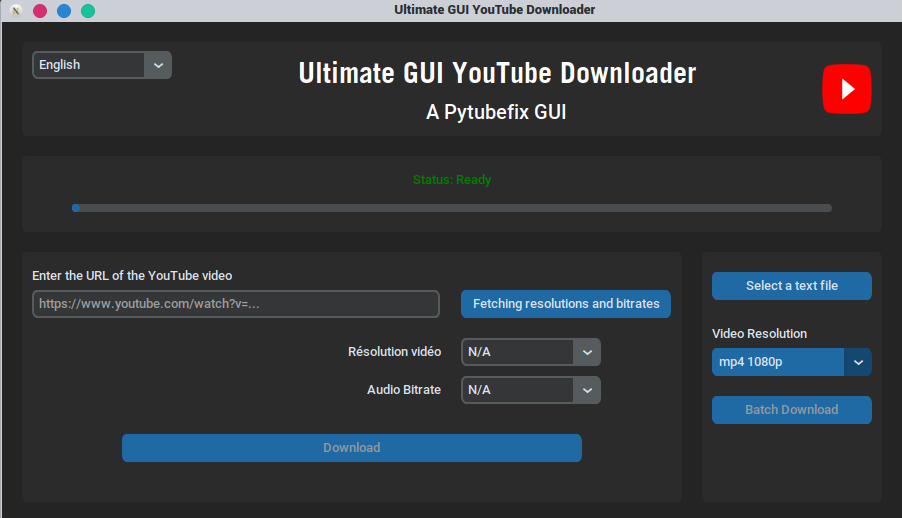

# Ultimate-GUI-YouTube-downloader (1.0.0)
This is a Pytubefix-based program with a CustomTkinter GUI to download YouTube content. 

The originality of this program lies in its ability to download videos in batches, thanks to a text file containing the desired YouTube links.

